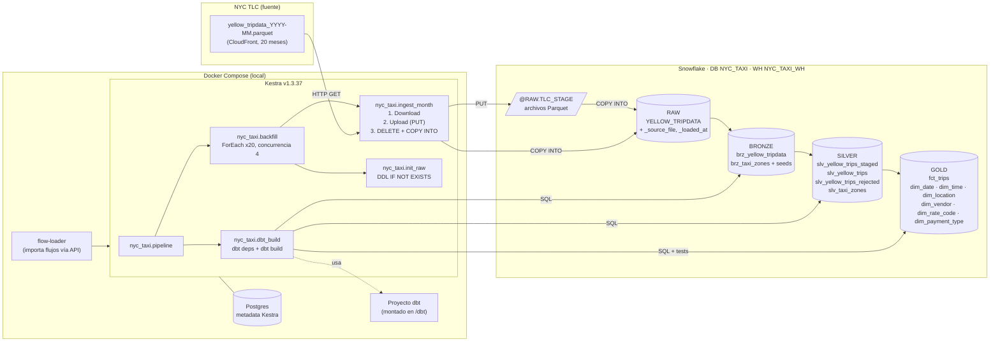

# Diagrama de arquitectura

## Flujo de datos

| Paso | Componente | Qué hace | Idempotencia |
|------|-----------|----------|--------------|
| 1 | `init_raw` | Crea esquema RAW, file format Parquet, stage interno y tabla raw | `CREATE ... IF NOT EXISTS` |
| 2 | `ingest_month` → Download | Descarga el Parquet del mes al storage de Kestra | — |
| 3 | `ingest_month` → Upload | `PUT` al stage `@RAW.TLC_STAGE/yellow/` | Sobrescribe el archivo |
| 4 | `ingest_month` → Queries | `DELETE` de las filas del archivo + `COPY INTO ... FORCE=TRUE` en una transacción | El mes se reemplaza completo |
| 5 | `dbt_build` → Bronze | Vistas sobre RAW con metadata de linaje (`_source_file`, `_source_period`, `_loaded_at`) | Vistas |
| 6 | `dbt_build` → Silver | Tipado, estandarización, nulos, códigos, deduplicación, reglas de invalidez | Incremental `delete+insert` por período |
| 7 | `dbt_build` → Gold | Esquema estrella (`fct_trips` + 6 dimensiones) | Tablas / incremental `delete+insert` por período |
| 8 | `dbt_build` → Tests | 88 tests (not_null, unique, relationships, accepted_values, expression_is_true, reconciliaciones) | — |
