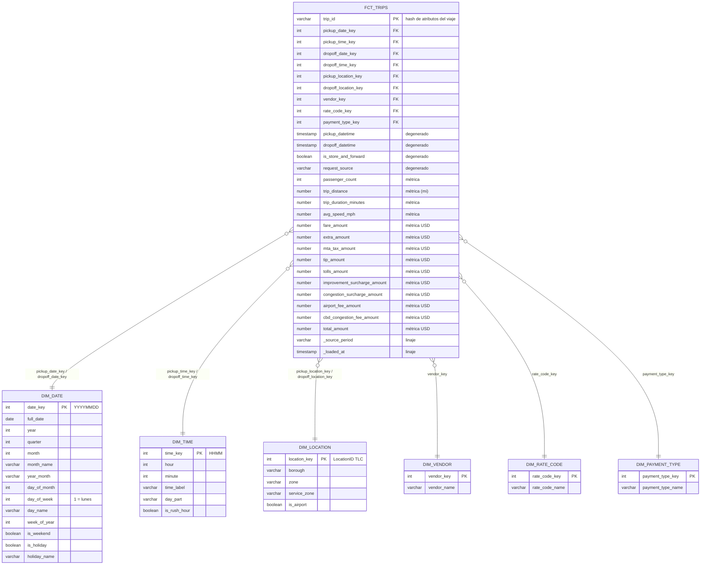

# Esquema estrella (capa GOLD)

**Grano de `fct_trips`:** un viaje válido de NYC Yellow Taxi (una fila por `trip_id`).

## Decisiones de modelado

| Elemento | Decisión |
|----------|----------|
| Grano | Un viaje. Es el nivel más atómico que entrega TLC, así se puede agregar a cualquier nivel (hora, día, zona, proveedor) sin perder información. |
| PK del hecho | `trip_id`: hash (`dbt_utils.generate_surrogate_key`) de todos los atributos del viaje. TLC no entrega un ID; el hash es determinista, así re-ejecutar produce la misma llave. |
| PKs de dimensiones | Llaves naturales enteras y estables: `date_key` = YYYYMMDD, `time_key` = HHMM, `location_key` = LocationID, códigos TLC para vendor/rate/payment. Son legibles y no dependen del orden de carga. |
| Role-playing | `dim_date`, `dim_time` y `dim_location` se usan dos veces (pickup y dropoff), sin duplicar tablas. |
| Miembros "Unknown" | `vendor_key = 99`, `rate_code_key = 99` y `payment_type_key = 5` absorben nulos y códigos fuera de catálogo; así toda FK es `not_null` y cumple `relationships`. |
| `dim_time` a nivel minuto | 1.440 filas; permite analizar por hora, franja del día u hora pico sin tocar el hecho. |
| Atributos degenerados | Timestamps exactos, `is_store_and_forward` y `request_source` se quedan en el hecho porque no tienen atributos descriptivos propios. |
| Métricas aditivas | Montos, distancia, duración y pasajeros son sumables; `avg_speed_mph` es no aditiva (se promedia). |
